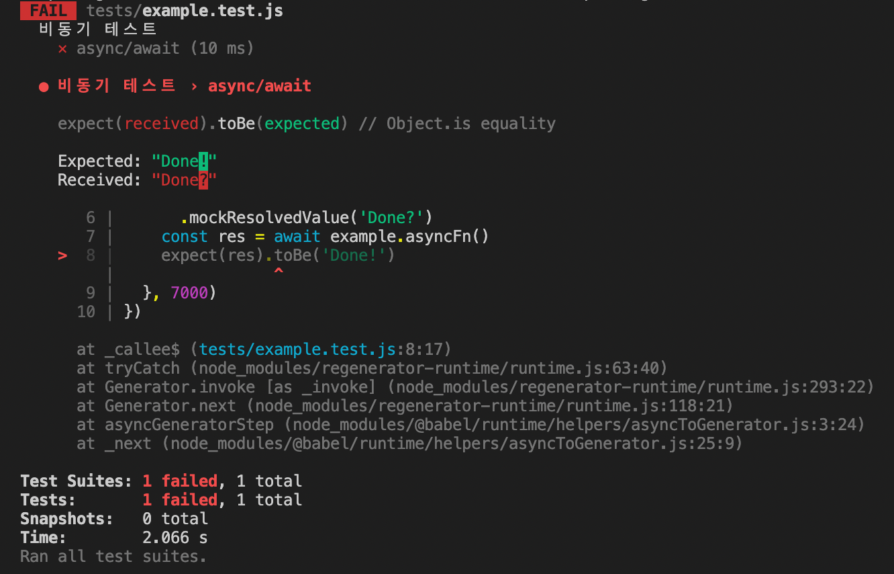

## 모의 함수 (Mock Function)
example.js

동작

1. `asyncFn` 함수를 `export` 키워드를 통해 내보내고 있음
2. 6초 뒤에 비동기로 Done!을 데이터로 반환

```jsx
// example.js

export function asyncFn() {
  return new Promise(resolve => {
    setTimeout(() => {
      resolve('Done!')
    }, 6000)
  })
}
```

example.test.js

1. `asyncFn` 비동기 함수를 `import`로 가지고 옴
2. `test` 콜백 함수를 실행 완료될 때까지 기다림
3. 그 결과를 `res`로 보내 `toBe`의 기댓값과 일치하는지 확인
4. 이 테스트는 실행 완료까지 총 6초가 걸리지만 기본 테스트는 5초까지만 시간 제공, 이를 오버하는 시간을 테스트하기 위해 세 번째 인수에다 7초까지 대기하도록 설정해 줌

```jsx
import { asyncFn } from './example'

describe('비동기 테스트', () => {
  test('async/await', async () => {
    const res = await asyncFn()
    expect(res).toBe('Done!')
  }, 7000)
})
```

- 6초를 기다리지 않아도 `asyncFn`에서 Done! 문자 데이터만 반환할 수 있다면 함수 로직이 정확하게 돌아간다는 것을 확인 가능
- 시간을 오버해서 동작시킬 필요가 없어짐
- 테스트 시간 절약

<br/>

### 모의 함수

- 모의(Mock): 무엇인가 임시로, 혹은 가짜로 시도해 보는 것
- 테스트에 방해되는 요인들을 모의의 개념으로 만들어 테스트를 진행 가능
- 시간이 걸리는 로직을 최소화할 때 사용

<br/>

예제 1

example.test.js

동작

1. `asyncFn` 비동기 함수가 `mockResolvedValue` 메소드를 통해 비동기로 실행되면 Done?이 반환되도록 설계
2. `example` 내부에서 `asyncFn`이 실행 후 반환되는 값을 `res`로 전달
3. `res`와 Done!이 일치하는지 확인

결과

- !과 ? 차이로 오류가 발생하기 때문에 해당 부분만 Done!으로 수정
- 또한 10ms 만에 테스트가 완료됐음을 확인 가능

```jsx
import * as example from './example'

describe('비동기 테스트', () => {
  test('async/await', async () => {
    jest.spyOn(example, 'asyncFn')
      .mockResolvedValue('Done?')
    const res = await example.asyncFn()
    expect(res).toBe('Done!')
  }, 7000)
})
```



<br/>

예제 2

example.js

Frozen II를 Frozen ii로 바꾸어 출력할 것

- 모든 글자를 소문자로 변경한 후 맨 첫 글자만 대문자로 변경하는 방식으로 진행
- `_upperFirst`: 맨 첫 글자를 대문자로 바꾸어 줌
- `_toLower`: 모든 글자를 소문자로 바꾸어 줌

```jsx
import axios from "axios"
import _upperFirst from 'lodash/upperFirst'
import _toLower from 'lodash/toLower'

export async function fetchMovieTitle() {
  const res = await axios.get('https://omdbapi.com?apikey=7035c60c&i=tt4520988')
  return _upperFirst(_toLower(res.data.Title))  // Frozen II => Frozen ii
}
```

example.test.js

- `fetchMovieTitle` 함수를 가지고 와 비동기로 진행되는 테스트 진행
- `title`에 담긴 값(Frozen ii)와 기댓값(Frozen ii?)가 같은지 확인
    - 일부러 틀리게 작성하여 테스트 정상적으로 동작하는지 확인

```jsx
import { fetchMovieTitle } from "./example"

describe('비동기 테스트', () => {
  test('영화 제목 변환', async () => {
    const title = await fetchMovieTitle()
    expect(title).toBe('Frozen ii?')
  })
})
```

- 그러나 만약 omdbapi에 영화 정보를 요청하여 가지고 오지 못하는 환경이라면 테스트가 불가능하게 됨
- 데이터를 가지고 오는 것은 작성된 로직이 아닌 omdbapi에서 이미 정의되어 있는 기본적인 구조이므로 omdbapi에서 데이터를 내어 주는지 아닌지는 테스트를 할 필요가 없음
- 데이터를 가지고 오는 것까지 테스트에 포함하는 것은 일종의 낭비
- 정보 요청 전송 코드를 모의의 개념으로 작성하여 테스트 진행

<br/>

`axios.get`을 모의 함수로 만들기

1. `jest.fn`을 통해 모의로 작성된 함수를 `axios.get`에 할당
2. `get`은 비동기로 동작하므로(example.js에서 `await` 키워드 사용) 비동기로 내부 로직 처리
3. `get`은 모의 함수로 동작하며 실행될 때 임의로 정의한 데이터가 반환
4. 그 반환된 내용이 `fetchMovieTitle` 내부에서 실행된 후 결과가 반환되어 `title`에 담김
5. `title` 값과 기댓값 비교

```jsx
import axios from 'axios'
import { fetchMovieTitle } from "./example"

describe('비동기 테스트', () => {
  test('영화 제목 변환', async () => {
    axios.get = jest.fn(() => {
      return new Promise(resolve => {
        resolve({
          data: {
            Title: 'Frozen II'
          }
        })
      })
    })
    const title = await fetchMovieTitle()
    expect(title).toBe('Frozen ii')
  })
})
```

네트워크를 끊고 테스트 동작시키면 모의 함수로 인해 테스트가 동작하게 됨  
외부 요인들에 인해 테스트가 실패하지 않도록 모의 함수를 사용하는 것