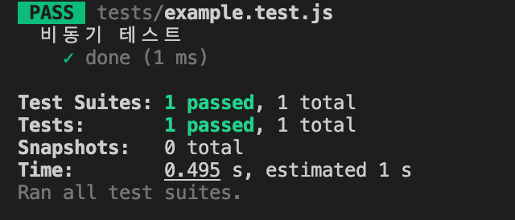
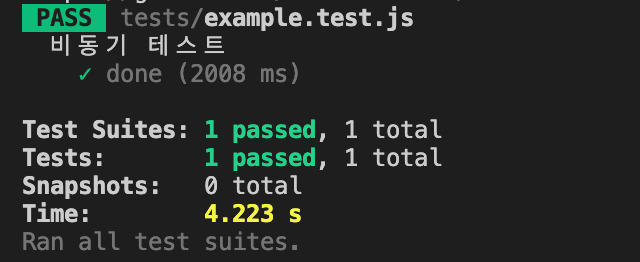
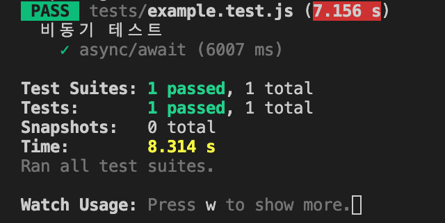

## 비동기 테스트

예제 1

example.test.js

```jsx
import { asyncFn } from './example'

describe('비동기 테스트', () => {
  test('done', () => {
    asyncFn().then(res => {
      expect(res).toBe('Done!')
    })
  })
})
```

example.js

```jsx
export function asyncFn() {
  return new Promise(resolve => {
    setTimeout(() => {
      resolve('Done!')
    }, 2000)
  })
}
```



<br/>

그러나 Done?으로 기댓값을 수정해도 통과 메시지가 뜨는 것을 확인할 수 있음

- 즉, 비동기 패턴으로 테스트 작성 시 테스트가 정상적으로 동작하지 않음
- 얼마나 기다려야 되는지 알 수 없기 때문에 기다리지 않고 바로 테스트 통과 메시지를 띄우고 넘어가는 것

```jsx
import { asyncFn } from './example'

describe('비동기 테스트', () => {
  test('done', () => {
    asyncFn().then(res => {
      expect(res).toBe('Done?')
    })
  })
})
```


<br/>

- 콜백 함수에서 done이라는 이름의 매개변수 사용 가능
- `done`: 비동기 테스트가 언제 종료되는지 명시하는 용도, 함수처럼 실행 가능
- `asyncFn` 함수가 2초 후에 실행되며 비동기 코드가 동작하면 테스트 코드 동작 후 `done` 매개변수 실행
    - 이 과정을 거친 후에 한 번의 테스트가 종료됐다고 판단함

```jsx
import { asyncFn } from './example'

describe('비동기 테스트', () => {
  test('done', (done) => {
    asyncFn().then(res => {
      expect(res).toBe('Done!')
      done()
    })
  })
})
```



<br/>

예제 2

- `test` 함수 내에서 비동기 코드가 반환되기 때문에 테스트 환경에서 `test`가 비동기 환경에서 진행되어야 한다는 것을 인지할 수 있음
- 비동기 코드가 마무리될 때까지 충분한 시간을 기다리고 나서 테스트를 동작시킴
- Done!과 Done?이 다르기 때문에 통과 X, 통과하기 위해서 Done!으로 수정해 주면 됨
- 첫 번째 패턴: `test` 함수가 내부에서 비동기 로직을 가지고 있는지 정확히 알 수 없으므로 `done`을 비동기가 끝난 다음 실행
- 두 번째 패턴: 비동기 함수를 반환하여 `test` 내부에서 비동기 동작, 반환된 비동기 함수가 마무리될 때까지 기다린 후 테스트 마무리

```jsx
import { asyncFn } from './example'

describe('비동기 테스트', () => {
  test('done', (done) => {
    asyncFn().then(res => {
      expect(res).toBe('Done!')
      done()
    })
  })

  test('then', () => {
    return asyncFn().then(res => {
      expect(res).toBe('Done?')
    })
  })
})
```

<br/>

예제 3

- `resolves`: 비동기 코드가 완료될 때까지 기다리도록 함
- 테스트 환경에서 정확히 얼마나 기다려야 하는지 모르기 때문에 `return` 키워드를 통해 밖으로 내보내야 함
- 테스트가 제대로 동작하는지 확인하기 위해 일부러 틀리도록 작성

```jsx
import { asyncFn } from './example'

describe('비동기 테스트', () => {
  test('done', (done) => {
    asyncFn().then(res => {
      expect(res).toBe('Done!')
      done()
    })
  })

  test('then', () => {
    return asyncFn().then(res => {
      expect(res).toBe('Done!')
    })
  })
  
  test('resolves', () => expect(asyncFn()).resolves.toBe('Done?'))
})
```

- 최대한 단순화하기 위해 `resolves` 브릿지 사용하는 것이므로 콜백으로도 확인

```jsx
import { asyncFn } from './example'

describe('비동기 테스트', () => {
  test('done', (done) => {
    asyncFn().then(res => {
      expect(res).toBe('Done!')
      done()
    })
  })

  test('then', () => {
    return asyncFn().then(res => {
      expect(res).toBe('Done!')
    })
  })
  
  test('resolves', () => expect(asyncFn()).resolves.toBe('Done!'))
})
```

<br/>

예제 4

- 콜백 자체를 비동기로 만들어 동작시킴
- `await` 키워드가 있는 부분에서 `resolve` 부분의 값이 반환될 것이므로 그것을 res로 받음
- `res`와 Done?이 일치하는지 확인 시 일치하지 않음을 확인 가능

```jsx
import { asyncFn } from './example'

describe('비동기 테스트', () => {
  test('done', (done) => {
    asyncFn().then(res => {
      expect(res).toBe('Done!')
      done()
    })
  })

  test('then', () => {
    return asyncFn().then(res => {
      expect(res).toBe('Done!')
    })
  })
  
  test('resolves', () => expect(asyncFn()).resolves.toBe('Done!'))

  test('async/await', async () => {
    const res = await asyncFn()
    expect(res).toBe('Done?')
  })
})
```

example.js

- 테스트 시간을 6초로 수정 시 테스트가 실패하는 것을 확인 가능
- `test` 함수는 최대 5초까지만 기다릴 수 있도록 설정되어 있음

```jsx
export function asyncFn() {
  return new Promise(resolve => {
    setTimeout(() => {
      resolve('Done!')
    }, 6000)
  })
}
```

- 7초까지 설정해 사용하고 싶은 경우 세 번째 인수로 ms 단위의 시간 지정

```jsx
//example.test.js

import { asyncFn } from './example'

describe('비동기 테스트', () => {
  test('async/await', async () => {
    const res = await asyncFn()
    expect(res).toBe('Done!')
  }, 7000)
})
```

