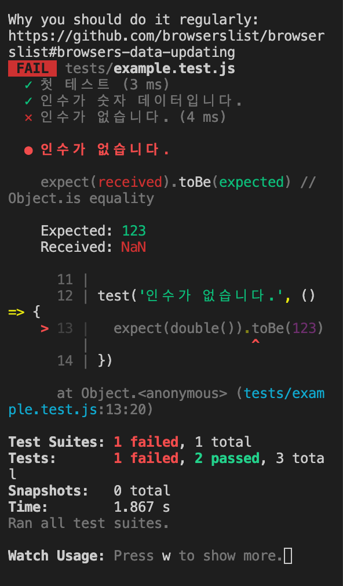

### 테스트 환경 구성
패키지 설치

```bash
npm i -D jest @vue/test-utils@next vue-jest@next babel-jest
```

jest.config.js

- node.js 환경에서 동작하는 파일

```jsx
module.exports = {
  // 파일 확장자를 지정하지 않은 경우, Jest가 검색할 확장자 목록입니다.
  // 일반적으로 많이 사용되는 모듈의 확장자를 지정합니다.
  // E.g. `import HelloWorld from '~/components/HelloWorld';`
  moduleFileExtensions: [
    'js',
    'vue'
  ],

  // `~` 같은 경로 별칭을 매핑합니다.
  // `<rootDir>` 토큰을 사용해 루트 경로를 참조할 수 있습니다.
  // E.g. `import HelloWorld from '~/components/HelloWorld.vue';`
  moduleNameMapper: {
    '^~/(.*)$': '<rootDir>/src/$1'
  },

  // // 일치하는 경로에서는 모듈을 가져오지 않습니다.
  // // `<rootDir>` 토큰을 사용해 루트 경로를 참조할 수 있습니다.
  modulePathIgnorePatterns: [
    '<rootDir>/node_modules',
    '<rootDir>/dist',
    '<rootDir>/cypress'
  ],

  // jsdom 환경에 대한 URL을 설정합니다.
  // https://github.com/facebook/jest/issues/6766
  testURL: 'http://localhost/',

  // 정규식과 일치하는 파일의 변환 모듈을 지정합니다.
  transform: {
    '^.+\\.vue$': 'vue-jest',
    '^.+\\.js$': 'babel-jest'
  }
}
```

example.test.js

- 그러나 ESLint에 의해 오류 발생

```jsx
test()
```

.eslintrc.js

- jest에서 오류가 발생하지 않도록 설정

```jsx
env: {
    browser: true,
    node: true,
    jest: true
  },
```

---

### 첫 테스트

package.json

- `test:unit`이라는 이름으로 jest를 실행
    - 현재 진행 테스트는 유닛 테스트라는 것을 명시
    - 감시되어 반복적으로 동작할 수 있도록 `—watchAll` 플래그 사용
    - 모든 테스트 파일에 변경 사항을 감시해 변경 사항 발생 시 테스트 환경을 다시 실행

```json
"scripts": {
    "dev:webpack": "webpack-dev-server --mode development",
    "dev": "netlify dev",
    "build": "webpack --mode production",
    "lint": "eslint --fix --ext .js,.vue",
    "test:unit": "jest --watchAll"
  },
```

example.js

- `double`이라는 함수를 테스트 환경에서 동작시켜 보기 위해서는 example.test.js에서 `test()`를 가지고 와야 함
    - `export` 키워드를 붙여 이름을 가진 함수 내보내기
- 테스트를 진행하기 위해 파일에 내보낼 수 있는 통로를 만들어야 한다는 점 유념
    - 데이터가 나올 수 없는 갇혀 있는 구조라면 코드를 일부 수정해야 함

```jsx
function double(num) {
  return num * 2
}
```

<br/>

example.test.js

테스트 1

```jsx
import { double } from './example'

test('첫 테스트', () => {
  expect(123).toBe(123)
})
```

- 테스트 실행
    - 첫 테스트라는 메시지 출력과 모두 통과했음을 확인 가능

```bash
npm run test:unit
```


<br/>

테스트 2

```jsx
import { double } from './example'

test('첫 테스트', () => {
  expect(123).toBe('123')
})
```

- 기대되는 값: 숫자 데이터 123
- 실제 입력된 값: 문자 데이터 123
- 두 개의 값이 일치하지 않기 때문에 테스트가 실패했다는 메시지 확인 가능
- `expect` 함수 통해 특정 값 입력, 기대되는 값을 `toBe` 메소드를 통해 입력하면 두 개의 값을 비교한 후 같으면 통과, 상이하면 실패


<br/>

테스트 3

```jsx
import { double } from './example'

test('첫 테스트', () => {
  expect(123).toBe(123)
})

test('인수가 숫자 데이터입니다.', () => {
  expect(double(3)).toBe(7)
})
```

- `double(3)`은 3*2가 계산되어 6이 입력되고, `toBe`를 통해 7을 기대한다고 작성했으므로 테스트 실패


 
<br/>

테스트 4

- 두 개의 값이 일치하면 테스트 통과 확인 가능

```jsx
import { double } from './example'

test('첫 테스트', () => {
  expect(123).toBe(123)
})

test('인수가 숫자 데이터입니다.', () => {
  expect(double(3)).toBe(6)
  expect(double(10)).toBe(20)
})
```


<br/>

테스트 5

- 인수가 없는 경우에는 매개변수가 받을 데이터가 없으므로 undefined로 동작
- undefined*2 가 숫자 데이터이기는 하나 출력할 형태가 아니므로 NaN 출력

```jsx
import { double } from './example'

test('첫 테스트', () => {
  expect(123).toBe(123)
})

test('인수가 숫자 데이터입니다.', () => {
  expect(double(3)).toBe(6)
  expect(double(10)).toBe(20)
})

test('인수가 없습니다.', () => {
  expect(double()).toBe(123)
})
```



<br/>

테스트의 장점

- 테스트를 통해 새로운 문제 발견 가능
- 같은 프로젝트를 개발하는 동료가 인수가 없는 상태로 실행했을 때 알 수 없는 곳에서 문제가 발생할 수 있으므로 테스트를 통해 검증
- 별도의 예외 처리도 가능해짐

<br/>

example.js

- `num` 값이 존재하지 않는 경우 0을 반환하겠다고 예외 처리 조건문 작성

```jsx
export function double(num) {
  if (!num) {
    return 0
  }
  return num * 2
}
```

<br/>

테스트 6

- 테스트의 기댓값을 123에서 0으로 바꾸어 테스트하면 예외 처리가 제대로 되고 있음을 확인 가능

```jsx
import { double } from './example'

test('첫 테스트', () => {
  expect(123).toBe(123)
})

test('인수가 숫자 데이터입니다.', () => {
  expect(double(3)).toBe(6)
  expect(double(10)).toBe(20)
})

test('인수가 없습니다.', () => {
  expect(double()).toBe(0)
})
```

